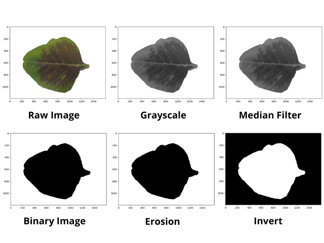

# Medical Leaf Image Classification

Unofficial implementation of [Mengenali Jenis Tanaman Obat Berbasis Pola Citra Daun 
Dengan Algoritma K-Nearest Neighbors](https://ejournal.unesa.ac.id/index.php/jinacs/article/download/42746/36728). This project is a part of my final project in Image Processing course.

## Dataset

The dataset used in this project is [Medical Leaf Image Dataset](https://data.mendeley.com/datasets/3f83gxmv57/1).

## Training Flow

1. Import image dataset
2. Preprocess image dataset
   1. Convert image to grayscale
   2. Median filter
   3. Thresholding (binary)
   4. Morphological operation (erosion)
   5. Invert image
3. Feature extraction (area, eccentricity, axis length, perimeter)
4. Feature scaling (min-max normalization)
5. Model training

## Result

### Image Preprocessing



### Feature Extraction

Here is the result of feature extraction from one of the images in the dataset.
``` python
{
    "area": array([677952.]),
    "eccentricity": array([0.47129833]),
    "major_axis_length": array([1001.20280051]),
    "minor_axis_length": array([883.03469571]),
    "perimeter": array([3516.70302783])
}
```

### Model Training Result

Here is the training and hyperarameter search result. The kNN model performance was really bad, different from the paper. I think the problem is in the dataset. The dataset used in the paper are only 15 classes, while the dataset used in this project are 30 classes though the dataset used in this project are same with the paper. Besides, the number of images in each class are too few.

``` python
Best score: 0.4550463188688445
Best parameter: {'n_neighbors': 7}
Test score: 0.4822888283378747
```

I also tried to train with different model, but the result was still bad. I think the problem is in the dataset. I will try to train with deep learning in the future.

## How to Use

1. Clone this repository
``` bash
git clone https://github.com/hiseulgi/medical-leaf-image-classification.git
```
2. Install dependencies
``` bash
pip install -r requirements.txt
```
3. Download dataset
``` bash
bash scripts/download_dataset.sh
```
4. Train model
``` bash
python src/train.py
```

## Future Works

* [ ] Deployment API/Gradio/Streamlit
* [ ] Train with Deep Learning